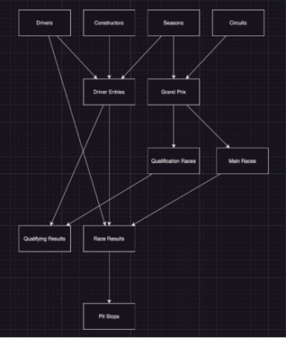
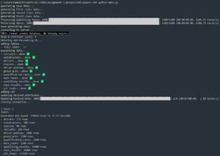

# F1 Datagen!

This project generates and writes life-like data into a MySQL database. 
It's currently being used to develop a formula database application.
It is designed for applications requiring realistic and consistent datasets with complex dependencies between data classes. 

The project consists of two primary modules:

- **Data Generator**: Creates the dataset as a Python object.
- **Data Writer**: Writes the generated datasets to a MySQL database.

## Features

### Data Generator
- **Modular Design**: Generates data in a dependency hierarchy to maintain consistency across datasets.
- **Realistic Randomization**:
    - Generates names, dates, and attributes following realistic distributions.
    - Assigns driver ages, activity periods, and race results aligned with real-world Formula 1 constraints.
- **Configurable Outputs**: Control parameters such as pit stop durations, race schedules, and qualification formats via `data_generator/config.py`.
- **Dependency Management**:

  - Ensures consistent references between datasets, such as linking seasons in race results with driver entries.
- **Diverse Data**:
    - Includes features like circuit locations, driver entries, race results, and more.
    - Supports male, female, and nonbinary names based on driver attributes.

### Data Writer
- **Database Integration**:
    - Automatically checks for the database and creates tables as needed.
    - Inserts data into the database while preserving cumulative properties like total points.
- **Error Handling**: Ensures data consistency and dependency resolution.

## Installation and Setup

1. **Install Python Packages**:
   Install the required dependencies by running:
   ```bash
   pip install -r requirements.txt
   ```
   or (if you're using pipenv like I am)
    ```bash
    pipenv install
    ```

2. **Set Up MySQL**:
    - Update `config.py` in the `data_writer` and `data_generator` directories with the correct database credentials (username, password, host, and database name).


3. **Configure Settings**:
   Customize generation parameters in the `config.py` files located in each module's directory.
## Usage

1. **Generate Data**:
   Run the data generation script:
   ```bash
   python src/main.py # or pipenv run python src/main.py
   ```
   This will create datasets for all entities in the schema and automatically save it to the database.

3. **View Outputs**:
   The console will display messages and statistics about the data generation and writing processes.
    <details>
        <summary>View Standard Output</summary>
   
   
   </details>
## Highlights

- Circuits are generated in a random country.
- Drivers are born on a random date and active in some range of years between the ages of 18 and 47 by default.

<details>
  <summary>More!</summary>

- Drivers may have died in the past or retired in the past. All seasons, race, and qualification entries are consistent with their age. No babies and no retirees race in Formula.
- Drivers get a male name if male, female name if female, and a nonbinary or androgynous name otherwise.
- Driver entries into any season link a driver to a team. Drivers can be the primary, secondary, or reserve driver, selected at random.
- Grand Prix can have either a regular qualifying race or a sprint qualifying. The rate of which is in the config (1/10 races are sprints by default).
- Main races are generated to occur on every Sunday of the season, sequentially, starting on the first Sunday of the year.
- Pit stop durations generate on a normal distribution about the average measured to 6 decimal places, in seconds.
- Pit stops are generated on a random lap in each race according to the total number of races in the result.
- Qualification races are generated to occur on every Saturday of the season, sequentially, starting on the first Saturday of the year.
- Qualifying results can only contain drivers that were 1) active (not retired that season) and 2) signed to a constructor active in that year.
- Qualifying results generate a position for the 20 drivers (all active teams must be present and put forward exactly 2 drivers each) and for each position the generator determines a time according to their position faster than some very fast base time. The average variance between first and last is equal to the average in formula by default.
- The gap between positions times is also calculated driver by driver.
- Race results can also only contain a position for the 20 drivers (all teams must be present and put forward exactly 2 drivers each).
- The points gained/lost depend on the position of the driver in the race. The lookup table for this point system can be configured in data_generator/config.py.
- The total pit stops taken in the race is a random int between the range of minimums defined in the config + some variance.

</details>


## Customization

Adjust various parameters in the `config.py` files, including:
- Driver age range and active years.
- Number of races per season.
- Pit stop duration distributions.

## Examples of Generated Data

- Drivers: Randomly generated with realistic birth dates and activity years.
- Constructors: Linked to drivers and seasons.
- Seasons, races, and qualification results: Consistently generated based on predefined constraints.

## Contributing

Feel free to submit issues or pull requests to improve this project.
